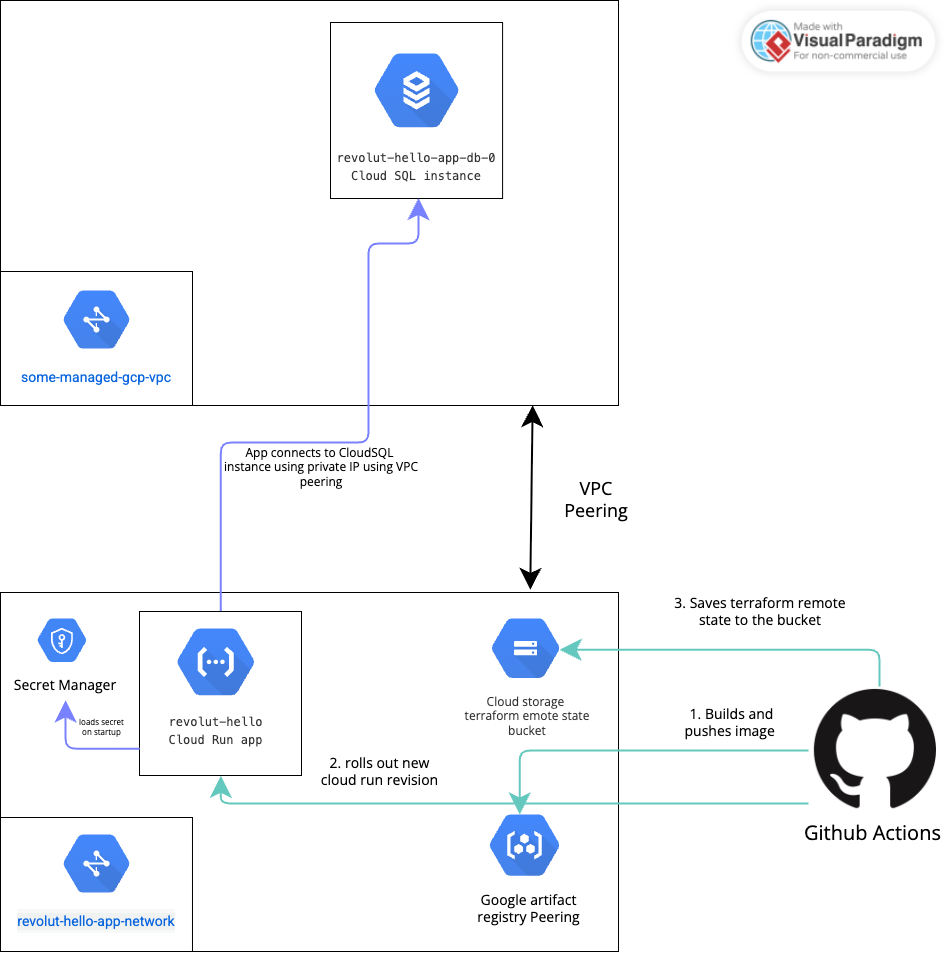

# Revolut Home Task - Hello World API

A test Node.js API service built with Express.js, featuring comprehensive infrastructure as code, automated CI/CD and testing.

## Problem Statement & Design

### Overview
This project demonstrates a API service that follows modern DevOps practices and architecture principles.

Application is available under this url:

https://revolut-hello-514230164013.europe-west1.run.app

### Architecture



#### Application Layer
- **Framework**: Express.js 5.x with ES modules
- **Language**: Node.js 22 (LTS)
- **Database**: Cloud SQL MySQL 8
- **Containerization**: Docker with Alpine Linux base image

#### Infrastructure Layer
- **Cloud Platform**: Google Cloud Platform (GCP)
- **Compute**: Cloud Run v2 (serverless containers)
- **Storage**: Google Cloud SQL instance MySQL
- **Infrastructure as Code**: Terraform for provisioning and management

#### Design Decisions Justification

1. **Cloud Run over GKE over Compute VM**: 
   - Reduced operational overhead
   - Automatic scaling and load balancing
   - Fits in GCP free tier
   - Built-in security and networking

2. **Cloud Storage vs Self Managed SQL instance**:
   - Simplified deployment (much less operational burden)
   - Cost-effective for small to medium workloads
   - Build it backups and point in time recovery

3. **Terraform for IaC**:
   - Declarative infrastructure management
   - Version-controlled infrastructure changes
   - Reproducible deployments across environments
   - Integration with GCP's native services

4. **Deployment Strategy**:
   - Zero-downtime deployments within Cloud Run revisions
   - Easy rollback capabilities
   - Risk mitigation for production releases


Sidenotes:

1. Infrastructure provisioning. Infrastructure defined in `infrastructure` folder should be separated from the application code base and managed separately by DevOps / Cloud team. It was kept here to simplify things and not create different repositories. Infrastructure's state declared in that folder should be stored in remote backend which is not implemented in this project, it's currently managed just manually from infrastructure administrator laptop.

2. Migrations. Migrations are declared in `src/migrations` folder. Each migration could contain either schema migration or data migration or both. Migration automatically applied whenever application starts. When application deployed having multiple replicas, db migrations will execute in every replica. For now in Cloud Run it would not be a problem because we don't have any traffic here which requires multiple replicas. But in real life projects it could create problems. Therefore, there could be 2 potential options to solve this problem: a) separate migrations to cloud run job and execute job before rolling out the application (removes the concurency) b) implement migration table locking and in case of 2 or more concurrent replicas start applying migrations concurrently, one of them acquire lock, others will wait (concurrency control)

3. Database backups. Again, for simplification I have not implemented any additional process for backuping data since we use Cloud SQL instance comes with build in backup capability. It could be done periodically additionally again using cloud run. In real life, it's obviously would be different and backups could be made using daatabase read replica, to avoid any kind of load or influence on the database which used to serve real traffic

4. Zero-downtime deployments. This is archivied by using cloud run. Cloud run uses revisions to deploy the application. If new revision fails to start or serve traffic, old revision is still active and serving. There are capabilities to gradual moving traffic to the new revision, which is in my opinion outside of the project scope.

5. Artifacts. On every push into main there will de a deployment and image created. Every image has git sha hash as tag. On production environment in could be more complicated, for example we could decide to use git tags and tag images accordingly, to keep more versioned approach. Also I find semver quite useful for that.

6. Logging. All logs produced by cloud run application are retained in GCP logs bucket.

7. Security considerations. 
a) All secrets values are stored in GCP secret manager. The GCP secret is provision using terraform. See infrastructure folder. The secret value is provisioned manually by administrator. 
b) Service accounts are used for deployment. Least privilege approach is used to assign necessary roles. Service account key is manually created and provisioned to GitHub actions secrets by administrator.
c) Cloud Run helps to setup necessary certificates and https in exposed endpoint, therefore there is no work to be done within this project scope here
d) CloudSQL instance currently allows unencrypted traffic. On production system it's recommended to enable only SSL connections. 

## Local Setup & Development

### Prerequisites
- Node.js 22.x
- Docker and docker-compose
- Terraform 1.5.7+

### One Click Local Development Setup 

1. **Start**
   ```bash
   # Start all services
   docker-compose up
   
   # View logs
   docker-compose logs -f app
   
   # Stop services
   docker-compose down
   ```

2. **Run Tests**
   ```bash
   npm test
   ```

#### Using Docker Directly

1. **Build Image**
   ```bash
   docker build -t revolut-hello-app .
   ```

2. **Run Container**
   ```bash
   docker run -p 3003:3003 revolut-hello-app
   ```

### Database Setup

#### MySQL (Docker Compose)
The application is configured to use MySQL when running with Docker Compose. The database is automatically created and configured with the following credentials:

- **Host**: `mysql` (container name)
- **Port**: `3306`
- **Database**: `revolut-hello-app-db`
- **User**: `revolut_user`
- **Password**: `revolut_password`

The database will be automatically migrated on application startup.

### Project Structure
```
revolut-hometask/
├── src/
│   ├── config/         # Configuration management
│   ├── db/             # Database connection configuration
│   ├── modules/        # Feature modules
│   ├── migrations/     # Database migrations
│   ├── utils/          # Utility functions
│   ├── index.js        # Application entry point
│   └── routes.js       # Route definitions
├── tests/
│   ├── integration/    # Integration tests
│   └── setup.js        # Test configuration
├── bin/                # Executable scripts
├── infrastructure/     # Infrastructure declaration
├── .github/workflows/  # CI/CD pipelines
├── Dockerfile          # Container definition
├── terraform.tf        # Infrastructure as Code
└── package.json        # Dependencies and scripts
```

### Code Quality Features

1. **Modular Architecture**: Clean separation of concerns with feature-based modules
2. **Configuration Management**: Environment-based configuration with dotenv
3. **Input Validation**: Joi schema validation for API endpoints
4. **Error Handling**: Centralized error handling and graceful shutdown
5. **Database Migrations**: Umzug-based migration system
6. **Testing**: Jest with Supertest for integration testing
7. **Logging**: Structured logging with proper error tracking

### Package Management
- **Package Manager**: npm with lockfile for reproducible builds
- **Dependencies**: Production and development dependencies properly separated
- **Scripts**: Standardized npm scripts for common operations

#### Infrastructure Security
- **IAM Integration**: Google Cloud IAM for service authentication
- **Network Policies**: Cloud Run's built-in network security
- **Secret Management**: Environment variables for sensitive data
- **Access Control**: Public access controlled via IAM policies

### Database Strategy

#### Migrations
- **Migration Tool**: Umzug for database schema management
- **Version Control**: Migrations tracked in version control
- **Rollback Support**: Downward migrations for schema rollbacks

#### Backup Strategy
- **Automated Backups**: Managed backups for Cloud SQL instance
- **Point-in-Time Recovery**: Enabled point in time recovery for Cloud SQL instance

#### Replication (Future Enhancement)
- **Read Replicas**: Can be implemented with managed database services
- **Failover**: Automatic failover with Cloud SQL or similar services

## CI/CD & Automation

### Continuous Integration

#### Pull Request Pipeline (`.github/workflows/verify.yaml`)

`verify.yaml` file implements very simple pull request pipeline that just runs application tests which blocks merging if tests fail. This pipeline obviously could be unlimitedly extended by adding linting, code coverage amnd many many more things

### Continuous Deployment

`deploy.yaml` file implements build & deployment of test application to GCP. In real life projects the strategy may differ a lot. Some projects would not want to have automatic deployments on any environment. On the other hand there are many examples when project demands continious delivery on production, which means deployment right after code lands to main branch. This approach requires significant test coverage and maturity of the engineering culture. I assumed this is out of this test project.

### Infrastructure Automation

#### Terraform Configuration
- **State Management**: GCS backend for state storage
- **Resource Provisioning**: Cloud Run, IAM, and storage resources
- **Environment Management**: Variable-based environment configuration
- **Security Hardening**: IAM policies and network security

#### Monitoring & Observability
- **Health Endpoints**: `/healthz/liveness` and `/healthz/readiness`
- **Logging**: Structured logging for application events
- **Metrics**: Cloud Run built-in metrics and monitoring
- **Alerting**: Cloud Monitoring integration (configurable)